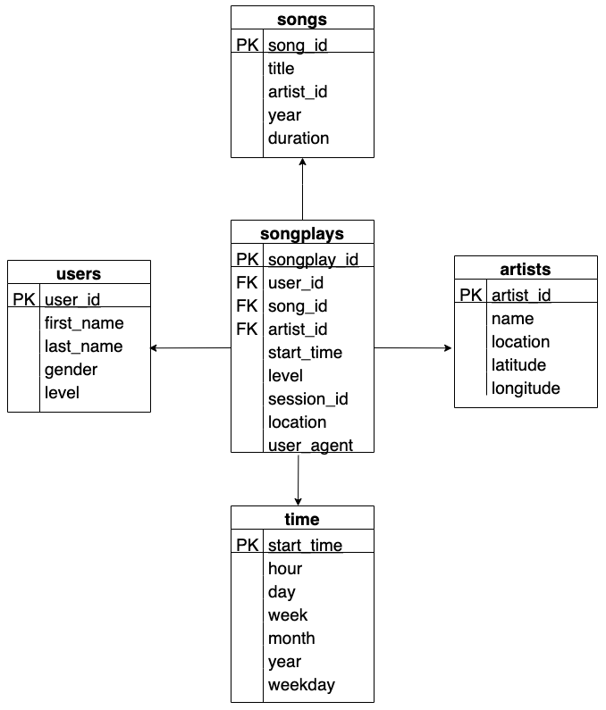

This project is part of the Data Engineering Nanodegree by Udacity.

## Purpose

Sparkify is a startup that have released a new music streaming application. In order to analyze their users behavior, they have been collecting songs and user activity data. The analytics team is mainly interested in knowing the popular songs played  among their users. In order to do this analysis easily, they want someone to develop a Postgres database in order to optimize their analytical operations. 

## Schema 
The used schema in this project is a Star Schema design.

The main reason behind building this database model, is for the analysis team to find the songs played by the app users. Since their needs are bound to measurable metrics, which can be found in the fact table, then the star schema is the preferred design in this case. Star schemas also have an important advantage: it requires minimum amount of joins between fact and dimension tables, hence higher performance.

The ETL pipeline taken in this project starts by extracting the data from song and log files, transforming them into summarized lists to fit to our schema design, and finally load them into the database tables.

## Example Queries

**Find all the songs played by our user:**
~~~
SELECT title from songs WHERE song_id IN (SELECT song_id FROM songplays WHERE song_id != 'None') 
~~~

**Output:**
> Setanta matins

**Find all the artist whom their songs are played by our users:**
~~~
SELECT name from artists WHERE artist_id IN (SELECT artist_id FROM songplays WHERE artist_id != 'None')
~~~

**Output:**
> Elena
    
**Find the top 3 locations using our app:**
~~~
SELECT COUNT(*), location FROM songplays GROUP BY LOCATION order by COUNT(*) DESC LIMIT 3
~~~
> 691 | San Francisco-Oakland-Hayward, CA
665	| Portland-South Portland, ME
557	| Lansing-East Lansing, MI

## Project Files

Files in this repository are as the following:
* sql_queries.py: Contains all the drop, create, insert and select queries.
* create_tables.py: Establish a connection to the database and create the required tables.
* etl.ipynb: Perform all the ETL processes on a subset of the data. (This file is mainly for trial and error purposes).
* etl.py: Perform all the ETL processes.
* test.ipynb: Perform data selection to check if the insertion has been done properly.
* schema.png: Contains a drawing of the schema design.
    
    
To run this project, you need to run these scripts in the terminal, in the following order:
1. create_tables.py, to create the Sparkify database and all the required tables.
2. etl.py, to execute the data transformation and load operations.

*Optionally*: You can run the test.ipynb in any IPython environment (ex: Jupyter Notebooks, Google Colab) to check if the data insertion has been executed probably.
